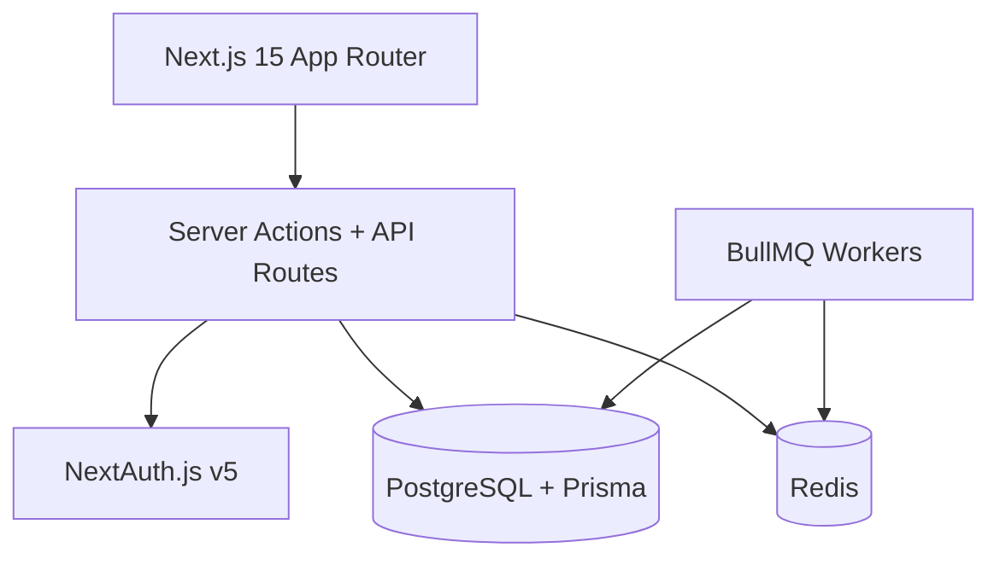

# RAMS — Ramaiah Automated Management System

Full-stack campus automation platform for M.S. Ramaiah Institute of Technology: semester-wise library management, automated fine/reservation workflows, RBAC, and search — built with Next.js 15, PostgreSQL, Prisma, Redis, and Docker.

## Architecture



## MCP Server

`apps/mcp-server` exposes the book catalog as MCP tools, so any MCP-compatible
AI client (Claude Desktop, Claude Code, etc.) can search and query the real
catalog directly in a normal chat conversation - no custom integration code
needed on the client side. See `apps/mcp-server/README.md` for setup and
Claude Desktop connection instructions.

## Tech Stack

| Tool | Why |
|------|-----|
| **Turborepo + pnpm** | Monorepo with shared types and cached builds |
| **Next.js 15** | SSR, App Router, server actions — single deploy target |
| **PostgreSQL + Prisma** | Relational model for issues, reservations, fines |
| **NextAuth.js v5** | JWT sessions, credentials auth, RBAC integration |
| **Redis + BullMQ** | Rate limiting, background jobs (fines, reminders) |
| **TanStack Query** | Server state, optimistic updates |
| **Tailwind + shadcn-style tokens** | MSRIT maroon/gold institutional branding |
| **Vitest** | Unit tests for fines, RBAC, demand alerts |
| **GitHub Actions** | CI: lint, typecheck, test, build |
| **Docker Compose** | Local Postgres + Redis |

## Features

### Core Library Automation
- Semester-wise book catalog with department/semester filters
- Book issue/return via barcode
- Reservation queue with 24-hour hold on return
- Automated fine calculation (grace period, cap)
- Role-based dashboards (Student, Faculty, Librarian, Admin)

### Real-Life Problem Solving
- Lost book workflow (schema + claims)
- Digital access logging for copyright compliance
- Book request pipeline for out-of-stock titles
- High-demand / low-stock alerts for librarians
- Audit log for login and critical actions

### DevOps & Reliability
- Health check endpoint (`/api/health`)
- Docker Compose for local infra, multi-stage production `Dockerfile` for the web app
- Structured logging (pino) for auth events and AI generation jobs
- CI pipeline with Postgres service container, pnpm version pinned to match the lockfile
- `.env.example` with all configuration

## Production Deployment

> **Important fix included in this update:** the CI/CD workflow files were
> previously located at `rams-platform/.github/workflows/`, which GitHub
> Actions never reads - it only picks up workflows from `.github/workflows/`
> at the actual repository root. That means CI was likely never running at
> all. This update moves them to the correct location
> (`UTILISE/.github/workflows/`) with paths adjusted for this repo's nested
> layout. See "Apply this update" below for the exact commands to relocate
> them in your own clone.

### Option A - self-host on a VPS with Docker Compose (cheapest, most control)

Works on any $5-6/mo VPS (DigitalOcean, Hetzner, Linode, etc.) with Docker installed:

```bash
git clone https://github.com/mahilohiya/UTILISE.git
cd UTILISE/rams-platform
cp .env.production.example .env.production
nano .env.production   # fill in real values - see comments in the file
docker compose -f docker-compose.prod.yml --env-file .env.production up -d --build
```

This runs the app, Postgres, and Redis together on one machine. Postgres/Redis
are not exposed to the internet (internal Docker network only) - only the
app's port 3000 is, and you should put a reverse proxy (Caddy is the
simplest - one line of config for automatic HTTPS) or your cloud provider's
load balancer in front of it for TLS.

Push the schema once, before first boot:
```bash
docker compose -f docker-compose.prod.yml --env-file .env.production run --rm app sh -c "cd packages/database && npx prisma db push"
```

### Option B - Railway or Render (no server management)

Both platforms can build directly from the `apps/web/Dockerfile` in this repo:
1. Connect your GitHub repo (`mahilohiya/UTILISE`)
2. Set the **root directory** to `rams-platform` and the **Dockerfile path** to `apps/web/Dockerfile`
3. Add a managed Postgres and Redis addon (both platforms offer these)
4. Set the same environment variables as `.env.production.example`
5. Deploy - both platforms auto-detect the `/api/health` endpoint for health checks

### Option C - automatic image builds via GitHub Actions

Once the workflow files are at the repo root (see the fix note above), every
push to `main` that touches `rams-platform/apps/web/**` automatically builds
and pushes a Docker image to `ghcr.io/mahilohiya/UTILISE:latest` - no Docker
Hub account needed, it uses your existing GitHub auth. Pull and run it
anywhere:
```bash
docker pull ghcr.io/mahilohiya/UTILISE:latest
```

### Apply this update to your local clone

```bash
# Move the workflow files to the real repo root
mkdir -p .github/workflows
git mv rams-platform/.github/workflows/ci.yml .github/workflows/ci.yml
rm -rf rams-platform/.github
```
Then copy in the new/changed files listed in the apply script from this
batch (docker-compose.prod.yml, .env.production.example, updated README,
and the new deploy.yml).

## Quick Start

### Prerequisites
- Node.js 18+
- pnpm 9+
- Docker

### 1. Start infrastructure

```bash
cd rams-platform
docker compose up -d
```

### 2. Install & setup database

```bash
pnpm install
cp .env.example apps/web/.env.local
cp .env.example packages/database/.env   # set DATABASE_URL

pnpm db:push
pnpm db:seed
```

### 3. Run development server

```bash
pnpm dev
```

Open [http://localhost:3000](http://localhost:3000)

### Demo Accounts

| Email | Role | Password |
|-------|------|----------|
| student@msrit.edu | Student | password123 |
| faculty@msrit.edu | Faculty | password123 |
| librarian@msrit.edu | Librarian | password123 |
| admin@msrit.edu | Admin | password123 |

## Project Structure

```text
rams-platform/
├── apps/web/                 # Next.js frontend + API routes
│   ├── app/                  # App Router pages & server actions
│   ├── components/           # UI components (DashboardLayout, Providers)
│   ├── lib/                  # RBAC, automation, utils
│   └── __tests__/            # Vitest unit tests
├── packages/database/        # Prisma schema, migrations, seed
├── docker-compose.yml        # Postgres + Redis
└── .github/workflows/ci.yml  # CI pipeline
```

## Scalability Notes

- **Stateless JWT sessions** — horizontal API scaling without sticky sessions
- **Redis caching** — session lookups, rate limiting, job queues
- **Background jobs** — fine calculation decoupled from request path
- **Department-scoped rows** — multi-tenancy ready for multiple colleges
- **Read replicas** — Prisma supports read/write splitting at scale
- **CDN** — book cover images via S3/R2 (schema supports `coverImageUrl`)

## Scripts

```bash
pnpm dev          # Start dev server
pnpm build        # Production build
pnpm test         # Run unit tests
pnpm db:seed      # Seed demo data (40 books, 8 departments)
pnpm db:migrate   # Run Prisma migrations
```

## License

MIT — Built for MSRIT portfolio demonstration.
