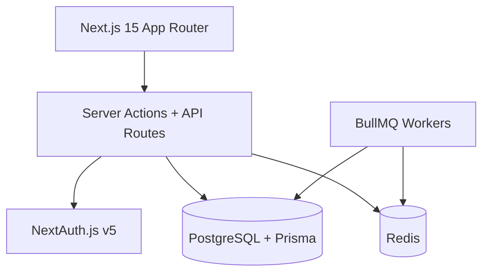

# RAMS — Ramaiah Automated Management System

Full-stack campus automation platform for M.S. Ramaiah Institute of Technology: semester-wise library management, automated fine/reservation workflows, RBAC, and search — built with Next.js 15, PostgreSQL, Prisma, Redis, and Docker.

## Project Status

Status: Production-ready prototype / portfolio-grade campus platform

Core modules currently in scope:
- Library catalog and semester-based discovery
- Book issue, return, and overdue management
- Reservation queue and hold logic
- Automated fine calculation and enforcement
- Role-based dashboards for student, faculty, librarian, and admin
- Lost book workflow and digital access logging
- Search, auditability, and health checks

This project is organized as a monorepo and is intended to be the active application in the repository, while deprecated legacy Java files remain archived separately.

## Architecture



## Tech Stack

| Tool | Why |
|------|-----|
| **Turborepo + pnpm** | Monorepo with shared types and cached builds |
| **Next.js 15** | SSR, App Router, server actions — single deploy target |
| **PostgreSQL + Prisma** | Relational model for issues, reservations, fines |
| **NextAuth.js v5** | JWT sessions, credentials auth, RBAC integration |
| **Redis + BullMQ** | Rate limiting, background jobs (fines, reminders) |
| **TanStack Query** | Server state, optimistic updates |
| **Tailwind + shadcn-style tokens** | MSRIT maroon/gold institutional branding |
| **Vitest** | Unit tests for fines, RBAC, demand alerts |
| **GitHub Actions** | CI: lint, typecheck, test, build |
| **Docker Compose** | Local Postgres + Redis |

## Features

### Core Library Automation
- Semester-wise book catalog with department/semester filters
- Book issue/return via barcode
- Reservation queue with 24-hour hold on return
- Automated fine calculation (grace period, cap)
- Role-based dashboards (Student, Faculty, Librarian, Admin)

### Real-Life Problem Solving
- Lost book workflow (schema + claims)
- Digital access logging for copyright compliance
- Book request pipeline for out-of-stock titles
- High-demand / low-stock alerts for librarians
- Audit log for login and critical actions

### DevOps & Reliability
- Health check endpoint (`/api/health`)
- Docker Compose for local infra
- CI pipeline with Postgres service container
- `.env.example` with all configuration

## Quick Start

### Prerequisites
- Node.js 18+
- pnpm 9+
- Docker

### 1. Start infrastructure

```bash
cd rams-platform
docker compose up -d
```

### 2. Install & setup database

```bash
pnpm install
cp .env.example apps/web/.env.local
cp .env.example packages/database/.env   # set DATABASE_URL

pnpm db:push
pnpm db:seed
```

### 3. Run development server

```bash
pnpm dev
```

Open [http://localhost:3000](http://localhost:3000)

### Demo Accounts

| Email | Role | Password |
|-------|------|----------|
| student@msrit.edu | Student | password123 |
| faculty@msrit.edu | Faculty | password123 |
| librarian@msrit.edu | Librarian | password123 |
| admin@msrit.edu | Admin | password123 |

## Project Structure

```text
rams-platform/
├── apps/web/                 # Next.js frontend + API routes
│   ├── app/                  # App Router pages & server actions
│   ├── components/           # UI components (DashboardLayout, Providers)
│   ├── lib/                  # RBAC, automation, utils
│   └── __tests__/            # Vitest unit tests
├── packages/database/        # Prisma schema, migrations, seed
├── docker-compose.yml        # Postgres + Redis
└── .github/workflows/ci.yml  # CI pipeline
```

## Scalability Notes

- **Stateless JWT sessions** — horizontal API scaling without sticky sessions
- **Redis caching** — session lookups, rate limiting, job queues
- **Background jobs** — fine calculation decoupled from request path
- **Department-scoped rows** — multi-tenancy ready for multiple colleges
- **Read replicas** — Prisma supports read/write splitting at scale
- **CDN** — book cover images via S3/R2 (schema supports `coverImageUrl`)

## Scripts

```bash
pnpm dev          # Start dev server
pnpm build        # Production build
pnpm test         # Run unit tests
pnpm db:seed      # Seed demo data (40 books, 8 departments)
pnpm db:migrate   # Run Prisma migrations
```

## License

MIT — Built for MSRIT portfolio demonstration.
