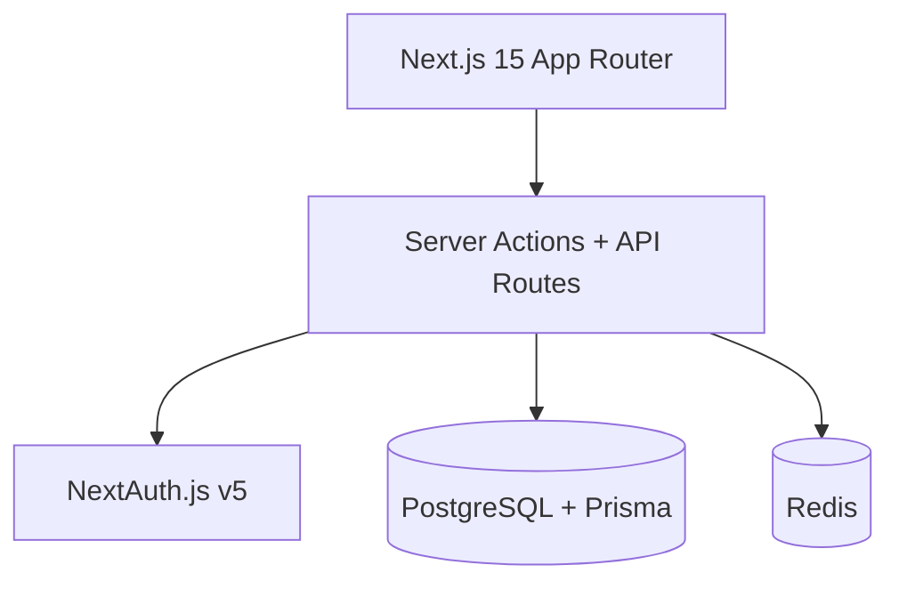

# RAMS — Ramaiah Automated Management System

Full-stack campus library portal for M.S. Ramaiah Institute of Technology: semester-wise catalog, role-based dashboards, fine automation, reservations, and AI Smart Notes — built with Next.js 15, PostgreSQL, Prisma, Redis, and Docker.

## Architecture



## Tech Stack

| Tool | Purpose |
|------|---------|
| **Turborepo + pnpm** | Monorepo with shared packages |
| **Next.js 15** | App Router, server actions |
| **PostgreSQL + Prisma** | Issues, reservations, fines, audit log |
| **NextAuth.js v5** | JWT sessions, credentials auth, RBAC |
| **Redis** | Rate limiting (Upstash optional) |
| **Tailwind** | MSRIT maroon/gold branding |
| **Vitest** | Unit tests for fines, RBAC, demand alerts |
| **Docker Compose** | Local Postgres + Redis |

## Feature status

What's actually in the codebase today — not aspirational.

### Implemented and usable

| Feature | Where to find it |
|---------|------------------|
| **Semester-wise catalog** | `/catalog` — filter by department/semester, search by title/author/ISBN |
| **Book reservations** | Catalog → Reserve button (queue with hold on return) |
| **Issue / Return (barcode)** | Librarian → Issue / Return |
| **Book requests (out-of-stock titles)** | Student/Faculty dashboard → Request a Book form; Librarian → **Requests** |
| **Lost book reporting** | Student dashboard → **Report Lost** on an issued book |
| **Fine calculation** | Admin → Analytics → **Run Fine Calculation** button |
| **Fine rules (grace period, per-day rate, cap)** | Admin → **Settings** |
| **Overdue tracking + reminders** | Librarian dashboard → Remind button |
| **Demand / low-stock alerts** | Admin → Analytics (amber alert section) |
| **Role-based dashboards** | Student, Faculty, Librarian, Admin — each with tailored views |
| **Notifications** | All roles → Notifications bell |
| **Smart Notes Generator** | Student/Faculty → Smart Notes (requires `GEMINI_API_KEY`) |
| **Audit log** | Written on login and critical actions |
| **Digital access logging** | Server action on digital book access |
| **MCP catalog server** | `apps/mcp-server/` — see its README |
| **Health check** | `GET /api/health` |
| **CI pipeline** | `.github/workflows/ci.yml` at repo root |

### Planned / not implemented

| Feature | Notes |
|---------|-------|
| **Automated nightly fine job (BullMQ worker)** | Fine calc works via manual admin button; no background worker process exists yet |
| **AI search assistant** | Landing page mentions it; search is keyword-based via `/api/search` |
| **Email notifications** | Schema supports it; no SMTP/Resend integration wired |
| **BullMQ reminder queue** | Librarian "Remind" creates in-app notifications only |

## Quick Start

### Prerequisites
- Node.js 18+
- pnpm 9+
- Docker

### 1. Start infrastructure

```bash
cd rams-platform
docker compose up -d
```

### 2. Install and configure

```bash
pnpm install
cp .env.example .env
cp .env.example apps/web/.env.local
cp .env.example packages/database/.env
```

Edit `apps/web/.env.local` and add a free Gemini key for Smart Notes (optional):

```bash
GEMINI_API_KEY=your-key   # https://aistudio.google.com/app/apikey
```

### 3. Set up database

```bash
pnpm db:push
pnpm db:seed
```

Re-run `pnpm db:seed` any time to refresh demo overdue books and notifications.

### 4. Run development server

```bash
pnpm dev
```

Open [http://localhost:3000](http://localhost:3000)

### Demo accounts

| Email | Role | Password |
|-------|------|----------|
| student@msrit.edu | Student | password123 |
| faculty@msrit.edu | Faculty | password123 |
| librarian@msrit.edu | Librarian | password123 |
| admin@msrit.edu | Admin | password123 |

**Demo data after seeding:**
- Student has 1 book due in 3 days, 1 book 5 days overdue (₹25 fine)
- 1 pending reservation
- 3 notifications

### Testing the fine calculator

1. Log in as `admin@msrit.edu`
2. Go to **Analytics** (`/dashboard/admin`)
3. Scroll to **Automation Jobs** → click **Run Fine Calculation**
4. Log in as `student@msrit.edu` to see updated fines and notifications

To change fine rules (grace period, rate, cap): Admin → **Settings**.

## MCP Server

`apps/mcp-server` exposes the book catalog as MCP tools for AI clients (Claude Desktop, etc.). See [`apps/mcp-server/README.md`](apps/mcp-server/README.md).

## Project structure

```text
rams-platform/
├── apps/web/                 # Next.js frontend + API routes
│   ├── app/                  # App Router pages & server actions
│   ├── components/           # DashboardLayout, Providers
│   ├── lib/                  # RBAC, automation/fines, AI notes
│   └── __tests__/            # Vitest unit tests
├── apps/mcp-server/          # MCP catalog tools
├── packages/database/        # Prisma schema, seed
├── docker-compose.yml        # Postgres + Redis
└── apps/web/Dockerfile       # Production container
```

## Production deployment

### Option A — VPS with Docker Compose

```bash
git clone https://github.com/mahilohiya/UTILISE.git
cd UTILISE/rams-platform
cp .env.production.example .env.production
# edit .env.production with real secrets
docker compose -f docker-compose.prod.yml --env-file .env.production up -d --build
```

Push schema before first boot:

```bash
docker compose -f docker-compose.prod.yml --env-file .env.production run --rm app sh -c "cd packages/database && npx prisma db push"
```

Put Caddy or nginx in front of port 3000 for HTTPS.

### Option B — Railway / Render

1. Connect GitHub repo `mahilohiya/UTILISE`
2. Set root directory to `rams-platform`, Dockerfile to `apps/web/Dockerfile`
3. Add managed Postgres + Redis
4. Set env vars from `.env.production.example`

### Option C — GitHub Actions Docker image

Pushes to `main` that touch `rams-platform/apps/web/**` build `ghcr.io/mahilohiya/UTILISE:latest` via `.github/workflows/deploy.yml`.

## Scripts

```bash
pnpm dev          # Start dev server (port 3000)
pnpm build        # Production build
pnpm test         # Run unit tests
pnpm typecheck    # TypeScript check
pnpm db:seed      # Seed demo data (40 books, 8 departments, demo issues)
pnpm db:push      # Push Prisma schema to DB
pnpm db:migrate   # Run Prisma migrations
```

## License

MIT — Built for MSRIT portfolio demonstration.
